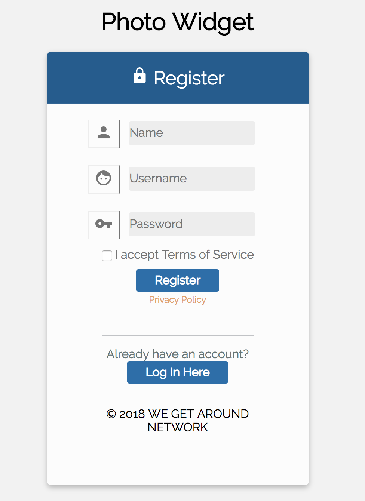
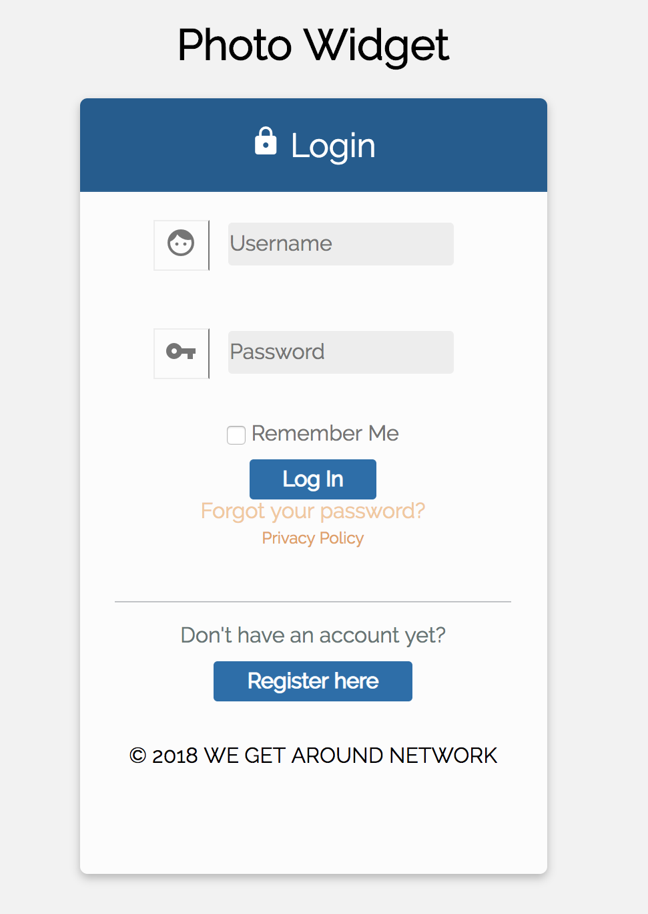

## I am currently building an application as a Software Developer Intern. This is a replication of the application I am building with some changes to add my own personal touch :). Enjoy!  

### Photo-Widget

Photo-Widget is an app built for subscribers to access a photo carousel. There is an upload section at the top allowing for users to upload photos to show in the photo carousel. The photo carousel has 5 slides. Each slide in the carousel allows the subscriber to view the before and after picture they have uploaded with a slider.  

## Technologies Used 

* JavaScript
* Node.js
* Express.js
* PostgreSQL
* HTML5
* CSS3

## Getting Started

These instructions will get you a copy of the project up and running on your local machine for development and testing purposes.

### Prerequisites

You will need to install the following dependencies:
Nodemon, Bcrypt, Body-Parser, Cocoen, Connect-pg-simple, Dotenv, Express, Express-session, Pg-promise, uuid.

I also recommend installing:
Debug, Reset-db

### Walk Through 

A step by step walk through of each page

Page 1: Registration Page - 
This page is where a subscriber can register to access the photo carousel.
Their is also contains a button at the bottom of the page where if a subscriber already has a account, they can click to be redirected to the login page.

<!--  -->

Page 2: Login Page - 
This page is where a subscriber can login to access the photo carousel.
This page is also where a subscriber can go to request assistance if they have forgotten their password
Lastly, there is a button at the bottom of the page to register for an account if they are a new subscriber. This button will redirect them to the registration page. 

<!--  -->

Page 3: Main Page -
This page contains the photo carousel. 
There is a upload photo section at the top of the page where subscribers can upload the photos they would like to show in the photo carousel. 
Lastly, this page contains a logout button at the top of the page to allow a user to exit this page. It will direct them back to the login page once they have logged out. 

<!--  -->

### Still Need To Do 
Work left to be completed is: 
* Finish upload photo to carousel slides connection.
* Media queries.

### Can be Added 
* Privacy policy link.
* Terms of service link.
* Forget password link.
* Editing users info (name, username, password) media queries for different size pages.
* CSS to developers preference.

## Authors

* **Helen Harris** - (https://github.com/hharris0803)

## Acknowledgments

* Login and register pages were inspired : MrLolok : https://github.com/MrLolok/Login-Register-Light-Template/
* Photo carousel was inspired by :  https://pawelgrzybek.github.io/siema/
* Photo slider was inspired by : npm package slider-before-after : https://www.npmjs.com/package/slider-before-after
* Readme page was inspired by : PurpleBooth : https://gist.github.com/PurpleBooth/109311bb0361f32d87a2#file-readme-template-md

## License
Copyright 2018 Helen Harris

Permission is hereby granted, free of charge, to any person obtaining a copy of this software and associated documentation files (the "Software"), to deal in the Software without restriction, including without limitation the rights to use, copy, modify, merge, publish, distribute, sublicense, and/or sell copies of the Software, and to permit persons to whom the Software is furnished to do so, subject to the following conditions:

The above copyright notice and this permission notice shall be included in all copies or substantial portions of the Software.

THE SOFTWARE IS PROVIDED "AS IS", WITHOUT WARRANTY OF ANY KIND, EXPRESS OR IMPLIED, INCLUDING BUT NOT LIMITED TO THE WARRANTIES OF MERCHANTABILITY, FITNESS FOR A PARTICULAR PURPOSE AND NONINFRINGEMENT. IN NO EVENT SHALL THE AUTHORS OR COPYRIGHT HOLDERS BE LIABLE FOR ANY CLAIM, DAMAGES OR OTHER LIABILITY, WHETHER IN AN ACTION OF CONTRACT, TORT OR OTHERWISE, ARISING FROM, OUT OF OR IN CONNECTION WITH THE SOFTWARE OR THE USE OR OTHER DEALINGS IN THE SOFTWARE.